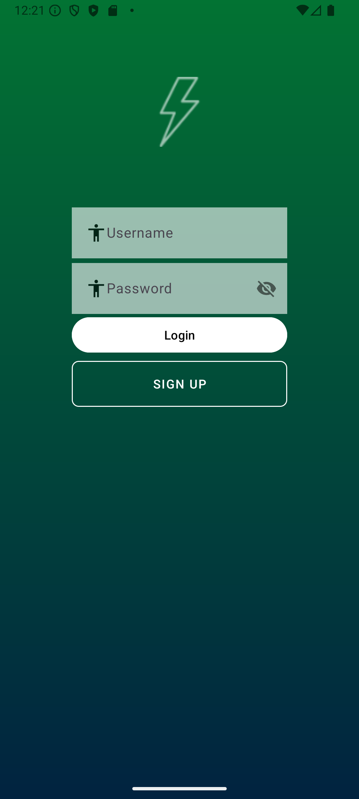
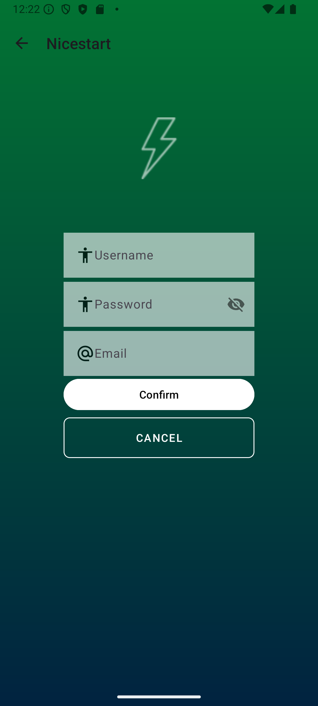
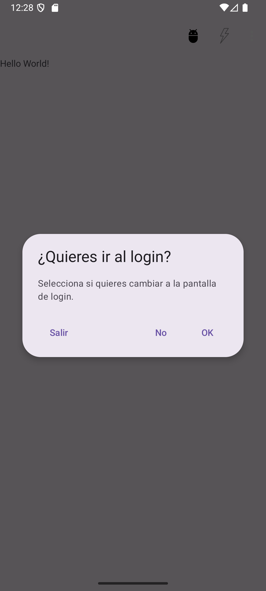

## Introducion a las interfaces

Este **repositorio** se usara durante diferentes proyectos.
De momento son unas activities interconectadas entre ellas para poder tener una navegacion sencilla.

|   Aqui esta la login activity    |    Aqui esta la sign In activity     |
|:--------------------------------:|:------------------------------------:|
|  |    |
|   |  |

Como se ha podido ver en la tabla anterior este proyecto se basa en varias activities en las cuales
tenemos la navegacion para poder iniciar sesion o registrarse en nuestra aplicacion, una vez realizado esto
tambien podemos ver como nos manda a nuestro perfil creado.
Para hacer uso de las maneras de navegar hemos añadido un alert dialog para poder ir desde la ventana del main a la de login
asi se puede navegar comodamente en nuestra app.

>This repository is licensed under
>[Creative Commons Attribution-ShareAlike 4.0](https://creativecommons.org/licenses/by-sa/4.0/)

